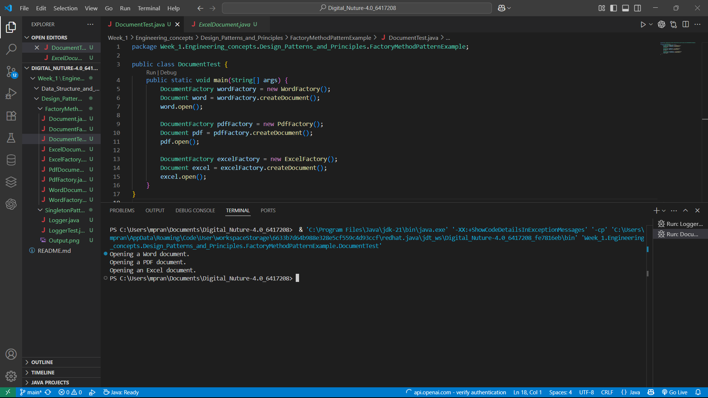

# 🏭 Factory Method Pattern in Java - Document Creation Example

This repository demonstrates the **Factory Method Design Pattern** using a document creation example in Java. The pattern defines an interface for creating an object but lets subclasses alter the type of objects that will be created.

---

## 📁 Project Structure

```
📦 FactoryMethodPatternExample
 ┣ 📜 Document.java           # Abstract product
 ┣ 📜 DocumentFactory.java    # Abstract factory
 ┣ 📜 WordDocument.java       # Concrete Word document
 ┣ 📜 PdfDocument.java        # Concrete PDF document
 ┣ 📜 ExcelDocument.java      # Concrete Excel document
 ┣ 📜 WordFactory.java        # Factory for Word documents
 ┣ 📜 PdfFactory.java         # Factory for PDF documents
 ┣ 📜 ExcelFactory.java       # Factory for Excel documents
 ┣ 📜 DocumentTest.java       # Tester class
 ┗ 📷 output.png              # Screenshot showing terminal output
```

---

## 🧠 What is the Factory Method Pattern?

The **Factory Method Pattern** is a creational design pattern that provides an interface for creating objects but allows subclasses to alter the type of objects that will be created. It promotes loose coupling and adheres to the Open/Closed Principle by delegating instantiation to subclasses.

---

## 💡 How It Works

In this project:

- `Document` is the abstract product.
- `DocumentFactory` is the abstract creator with a `createDocument()` method.
- `WordFactory`, `PdfFactory`, and `ExcelFactory` are concrete factories that return their respective `Document` types.
- `DocumentTest.java` demonstrates the creation and usage of all document types via their factories.

---

## 🧪 Output

Running `DocumentTest.java` will produce the following terminal output:

```
Opening a Word document.
Opening a PDF document.
Opening an Excel document.
```

📷 You can view the output screenshot here:



---

## 🚀 How to Run

1. Clone the repository:

   ```bash
   git clone https://github.com/your-username/factory-method-pattern-documents.git
   cd factory-method-pattern-documents
   ```

2. Compile the Java files:

   ```bash
   javac *.java
   ```

3. Run the program:

   ```bash
   java DocumentTest
   ```

---

## 📚 Concepts Demonstrated

- ✅ Factory Method Design Pattern
- ✅ Abstract and concrete class relationships
- ✅ Loose coupling through interfaces
- ✅ Real-world analogy using documents

---

## 🧑‍💻 Author

**Pranesh M**  
🚀 B.Tech - AI & DS, Batch 2026  
📫 [Email Me](mailto:m.pranesh15112004@gmail.com)

---

## 🌟 Support

If you found this helpful, please ⭐️ this repository and follow me on [GitHub](https://github.com/your-username)!

---

## 📄 License

This project is licensed under the [MIT License](LICENSE).
