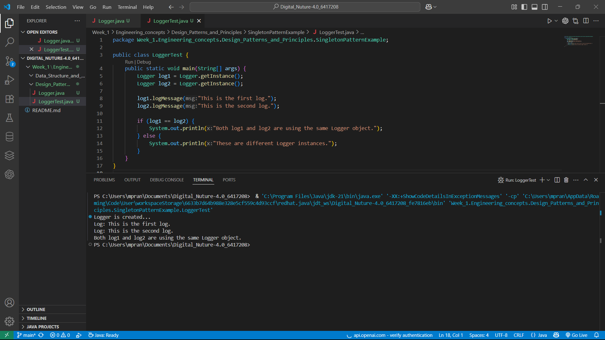

# 🧩 Singleton Pattern in Java - Logger Example

This repository demonstrates the **Singleton Design Pattern** using a `Logger` class in Java. The pattern ensures that only one instance of a class is created and provides a global point of access to it.

---

## 📁 Project Structure

```
📦 SingletonPatternExample
 ┣ 📜 Logger.java        
 ┣ 📜 LoggerTest.java    
 ┗ 📷 Output.png         
```

---

## 🧠 What is the Singleton Pattern?

The **Singleton Pattern** is a creational design pattern that restricts the instantiation of a class to a single object. It is useful when exactly one object is needed to coordinate actions across a system, such as a logger, configuration manager, or connection pool.

---

## 💡 How It Works

In this project:

- `Logger.java` implements the Singleton design pattern.
- The `getInstance()` method checks if an instance already exists; if not, it creates one.
- The constructor is `private` to prevent instantiation from outside the class.
- All log messages go through the same `Logger` instance.

---

## 🧪 Output

Running `LoggerTest.java` will give the following output:

```
Logger is created...
Log: This is the first log.
Log: This is the second log.
Both log1 and log2 are using the same Logger object.
```

📷 You can view the full terminal output screenshot here:




## 📚 Concepts Demonstrated

- ✅ Singleton Design Pattern
- ✅ Static instance management
- ✅ Controlled object instantiation
- ✅ Basic logging utility

---

## 🧑‍💻 Author

**Pranesh M**  
🚀 B.Tech - AI & DS, Batch 2026  
📫 [Email Me](mailto:m.pranesh15112004@gmail.com)

